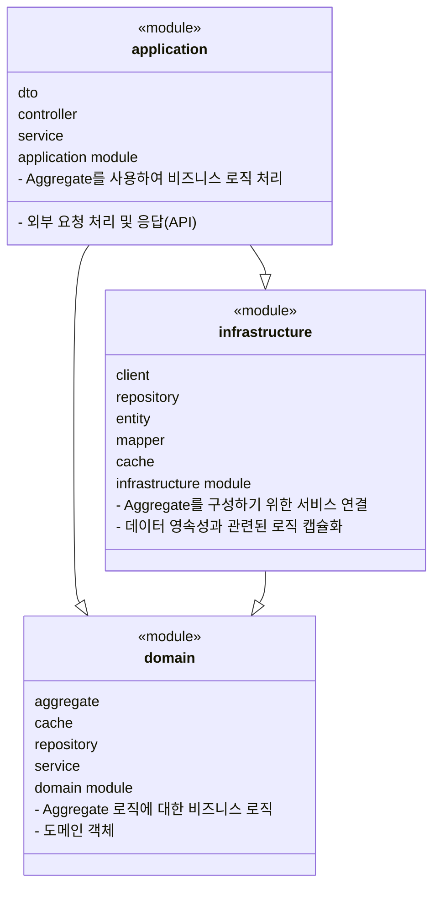

# Letsbe time-slot-cache

- JDK 17
- Spring Boot 3.2.0
- gradle 8.2

## Introduction

OpenEndRange<Instant>를 어떤 식으로 다루면 좋을까 고민하다가 만들어본 캐시입니다.
캐시는 Redis를 사용하고, 비트맵을 사용하여 저장하고 조회합니다.
비트맵 기반 접근 방식은 작은 스토리지 사용과 빠른 액세스를 보장하므로 효율적인 슬롯 관리가 필요한 서비스에 적용하기 좋습니다.

## IDEA

`OpenEndRange<Instant>`[시작, 끝)을 기준일(7일) 기준시간(10분)으로 분리하여 REDIS BITMAP에 저장합니다.
- key는 시간 슬롯 범위의 시작점이고, 각 비트는 Duration(10분) 단위로 시간 슬롯의 사용 가능 여부를 나타냅니다.
- Redis 기본조회 조건을 일요일로 설정하여 7일 단위로 데이터를 모아서 저장합니다. (7일*24시간*60분/(10분)=1008비트 ~= `1024bit word단위`)
- 긴 기간의 TimeSlot을 조회할 때는 여러개의 key를 조회하여 합집합을 구합니다.
- 짧은 기간의 TimeSlot을 조회할 때는 하나의 key를 조회하여 대상 Bit만 뽑아 Deserialize 합니다.

| 기준 | BitSet 사용 | Interval 객체 사용 |
| --- | --- | --- |
| **저장 공간 효율성** | 높음 (1비트로 표현) | 낮음 (객체에 더 많은 정보 저장) |
| **접근 시간** | 빠름 (상수 시간) | 상대적으로 느림 (객체 순회 필요) |
| **유연성** | 낮음 (시간 슬롯 사용 여부만 표현) | 높음 (추가 정보 저장 가능) |
| **데이터 구조의 직관성** | 낮음 (비트 인덱스 계산 필요) | 높음 (시작/종료 시간 명확) |
| **추가 정보 저장** | 어려움 | 용이 |

### [TimeSlotCache](./subprojects/domain/src/main/kotlin/com/letsbe/domain/time/cache/TimeSlotCache.kt): Manages the time slot data.
  - baseTime: 시간 슬롯 범위의 시작점입니다.
  - slot: 시간 슬롯의 사용 가능 여부를 나타내는 비트셋입니다.
  - key: Redis 키를 생성하기 위해 지연 초기화된 속성입니다.
  - value: 시간 슬롯을 나타내는 시작시각에서 OpenEndRange을 생성하기 위해 지연 초기화된 속성입니다.

|BIT| DESC    |
|---|---------|
|0| ENABLE  |
|1| DISABLE |

## System Architecture

time-slot-cache는 다음과 같은 구조로 이루어져 있습니다.

### Gradle Multi-Project
- [main](./build.gradle.kts)
- [application](./subprojects/application/build.gradle.kts)
- [domain](./subprojects/domain/build.gradle.kts)
- [infrastructure](./subprojects/infrastructure/build.gradle.kts)

